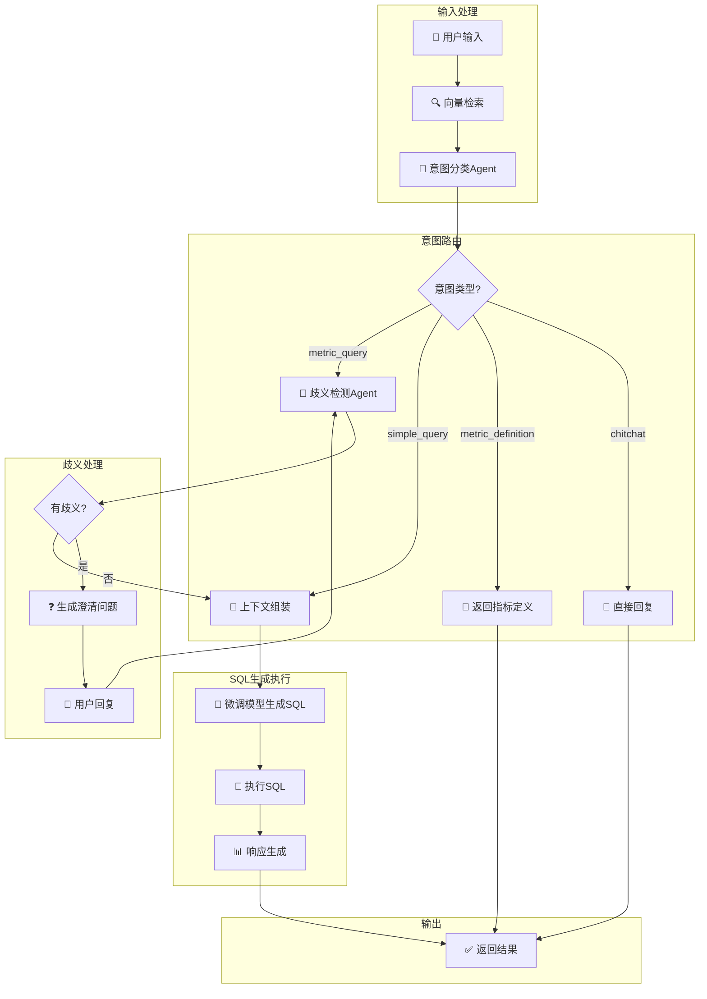

# Text2SQL 智能体系统

基于 LangGraph 构建的教育指标体系 Text2SQL 智能体，支持意图识别、歧义澄清和 SQL 生成。

---

## 系统流程图



---

## 意图类型说明

| 意图类型 | 说明 | 示例 |
|---------|------|------|
| `chitchat` | 闲聊/帮助 | "你好"、"帮助" |
| `metric_definition` | 询问指标定义 | "什么是数字素养" |
| `simple_query` | 简单数据查询 | "有多少学校" |
| `metric_query` | 指标相关查询 | "基础设施情况" |

---

## 快速开始

### 1. 安装依赖
```bash
cd d:\text2sql
pip install -r requirements.txt
```

### 2. 配置环境变量
编辑 `.env` 文件：
```env
# LLM 配置
LLM_API_BASE=http://localhost:11434/v1
LLM_MODEL_NAME=qwen2.5:7b

# Embedding 配置
EMBEDDING_API_BASE=http://localhost:11434
EMBEDDING_MODEL_NAME=bge-m3:latest

# 微调模型
FINETUNED_API_BASE=http://localhost:11434
FINETUNED_MODEL_NAME=text2sql-finetuned

# MySQL
DB_HOST=localhost
DB_USER=root
DB_PASSWORD=your_password
DB_NAME=education_metrics
```

### 3. 运行
```bash
python main.py
```

---

## 使用示例

```
用户: 你好
助手: 您好！我是教育指标数据查询助手...

用户: 基础设施情况怎么样
助手: 您的查询可能存在以下不明确之处：
      1. 您是要查看所有二级指标还是汇总数据？
      2. 需要指定哪个地区或年份吗？

用户: 查看北京市的网络覆盖率
助手: 查询完成，共找到 X 条结果...
      执行的 SQL: SELECT ...
```

---

## 文件结构

```
text2sql/
├── main.py              # 入口文件
├── config.py            # 配置管理
├── state.py             # 状态定义
├── graph.py             # LangGraph 编排
├── vector_store.py      # 向量检索
├── .env                 # 环境变量
├── requirements.txt     # 依赖项
├── 基教指标.json         # 指标体系定义
├── test_number.json     # 数据库 Schema
└── agents/
    ├── intent_classifier.py   # 意图分类
    ├── ambiguity_checker.py   # 歧义检测
    ├── context_assembler.py   # 上下文组装
    ├── sql_generator.py       # SQL 生成
    ├── sql_executor.py        # SQL 执行
    └── response_generator.py  # 响应生成
```

---

## 命令说明

| 命令 | 说明 |
|------|------|
| `quit` / `exit` | 退出程序 |
| `reset` | 重置对话状态 |
