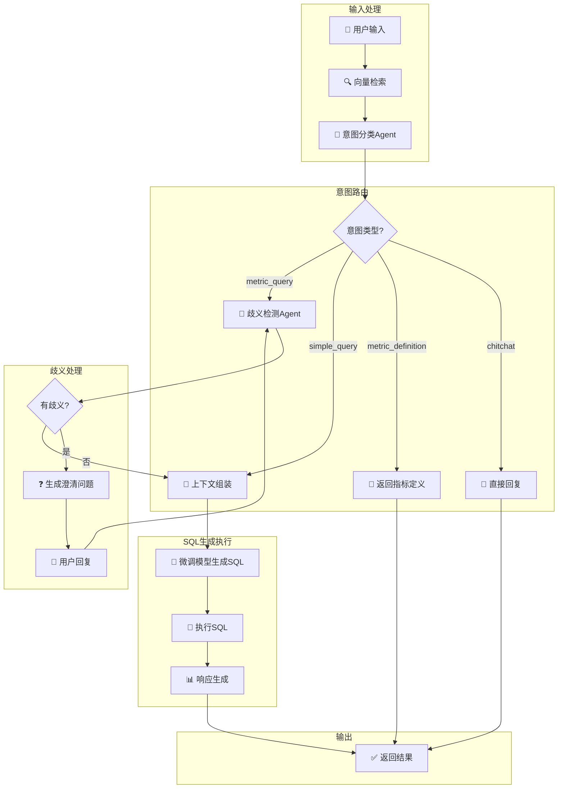

# Text2SQL 智能体系统

基于 LangGraph 构建的教育指标体系 Text2SQL 智能体，支持意图识别、歧义澄清和 SQL 生成。

---

## 系统流程图


```mermaid
flowchart TD
    subgraph 输入处理
        A[👤 用户输入] --> B[🔍 向量检索]
        B --> C[🧠 意图分类Agent]
    end
    
    subgraph 意图路由
        C --> D{意图类型?}
        D -->|chitchat| E[💬 直接回复]
        D -->|metric_definition| F[📖 返回指标定义]
        D -->|simple_query| G[📝 上下文组装]
        D -->|metric_query| H[🔎 歧义检测Agent]
    end
    
    subgraph 歧义处理
        H --> I{有歧义?}
        I -->|是| J[❓ 生成澄清问题]
        J --> K[👤 用户回复]
        K --> H
        I -->|否| G
    end
    
    subgraph SQL生成执行
        G --> L[🤖 微调模型生成SQL]
        L --> M[💾 执行SQL]
        M --> N[📊 响应生成]
    end
    
    subgraph 输出
        E --> O[✅ 返回结果]
        F --> O
        N --> O
    end
```

---

## 意图类型说明

| 意图类型 | 说明 | 示例 |
|---------|------|------|
| `chitchat` | 闲聊/帮助 | "你好"、"帮助" |
| `metric_definition` | 询问指标定义 | "什么是数字素养" |
| `simple_query` | 简单数据查询 | "有多少学校" |
| `metric_query` | 指标相关查询 | "基础设施情况" |

---

## 快速开始

### 1. 安装依赖
```bash
cd d:\text2sql
pip install -r requirements.txt
```

### 2. 配置环境变量
编辑 `.env` 文件：
```env
# LLM 配置
LLM_API_BASE=http://localhost:11434/v1
LLM_MODEL_NAME=qwen2.5:7b

# Embedding 配置
EMBEDDING_API_BASE=http://localhost:11434
EMBEDDING_MODEL_NAME=bge-m3:latest

# 微调模型
FINETUNED_API_BASE=http://localhost:11434
FINETUNED_MODEL_NAME=text2sql-finetuned

# MySQL
DB_HOST=localhost
DB_USER=root
DB_PASSWORD=your_password
DB_NAME=education_metrics
```

### 3. 运行
```bash
python main.py
```

## Local Operator Runbook (MAZE Architecture)

This section covers how to start the full M.A.Z.E stack (Cube.js semantic server + Text2SQL API) and verify functionality.

### Prerequisites

- Python 3.10+ with `pip install -r requirements.txt` completed
- MySQL running on `localhost:3306`, database `test_number`, credentials in `text2sql/.env`
- Node.js + npm available (for Cube.js dev server)

### Chart & Replay Compatibility

- **Replay**: All legacy SQL trajectories remain playable. Semantic trajectories require `USE_SEMANTIC_METRIC_QUERY=true` for full fidelity replay of the analysis step.
- **Chart**: The frontend supports both standard SQL result sets and complex analysis results (JSON) from the semantic path.

### Startup Sequence

**Step 1 — Start Cube semantic server**

```bash
cd "D:\text2sql v1.3\my-cube-project"
npm run dev
```

Wait until the Cube dev server is ready (it will print a `🚀 Cube API` line), then verify:

```bash
curl http://localhost:4000/cubejs-api/v1/meta -H "Authorization: Bearer maze_dev_secret"
# Expected: JSON with cubes: [Questions, SchoolAnswers, Schools]
```

**Step 2 — Start Text2SQL API**

```bash
cd "D:\text2sql v1.3\text2sql"
python api.py
```

Verify Health:

```bash
curl http://localhost:8000/api/health
# Expected: {"status":"ok"}
```

**Step 3 — Confirm Semantic Flags in `.env`**

The file `D:\text2sql v1.3\text2sql\.env` must contain these active flags for the semantic path:

| Flag | Description |
|------|-------------|
| `USE_SEMANTIC_METRIC_QUERY` | Routes metric-heavy intents to the MAZE semantic engine |
| `USE_CONSTRAINED_PLANNER` | Forces the planner to use semantic cube definitions instead of raw SQL |
| `USE_CUBE_SCHEMA_SOURCE` | Fetches schema context from Cube.js instead of static files |
| `USE_DUCKDB_EXECUTOR` | Enables local multi-step analysis via DuckDB |
| `CUBE_API_SECRET` | Auth token for the Cube.js backend |

### Rollout Smoke Tests

**METRIC_QUERY** (MAZE semantic path — triggers clarification or full analysis):

```bash
curl -s -X POST http://localhost:8000/api/chat \
  -H "Content-Type: application/json" \
  -d "{\"message\":\"对比各省基础设施综合得分排名\",\"session_id\":\"smoke-metric\",\"workspace_id\":\"default\"}"
# Expected: HTTP 200, intent_type="IntentType.METRIC_QUERY"
```

**VALUE_QUERY** (legacy SQL path — returns SQL + result count):

```bash
curl -s -X POST http://localhost:8000/api/chat \
  -H "Content-Type: application/json" \
  -d "{\"message\":\"北京市学校数量是多少\",\"session_id\":\"smoke-value\",\"workspace_id\":\"default\"}"
# Expected: HTTP 200, intent_type="IntentType.VALUE_QUERY", sql field non-null
```

### Rollback and Restore

**Emergency Rollback (Disable MAZE, Revert to Legacy)**

1. Open `text2sql/.env`.
2. Set `USE_SEMANTIC_METRIC_QUERY=false` and `USE_CONSTRAINED_PLANNER=false`.
3. Restart the API: `python api.py`.
4. Both query types will now run through the legacy SQL path without DuckDB or Cube.

**Restoration (Re-enable MAZE)**

1. Open `text2sql/.env`.
2. Set `USE_SEMANTIC_METRIC_QUERY=true` and `USE_CONSTRAINED_PLANNER=true`.
3. Restart the API: `python api.py`.

### Failure Handling Policy

| Scenario | Behavior |
|----------|----------|
| Cube server offline | Schema source degrades to static metadata; semantic execution returns `语义执行降级: Cube unreachable...`; API stays HTTP 200 |
| DuckDB step failure | Last successful step's rows preserved in `analysis_result` via `DuckDBExecutorError.partial_artifacts`; `analysis_error` surfaced as message |
| Partial artifacts on disk | Parquet spill files at `.sisyphus/tmp/duckdb/<workspace>/<request>/` persist until cleanup |
| User-visible partial results | Only returned when `analysis_result` is non-empty and verification passed; otherwise `analysis_error` is shown |

### Cube MySQL Driver Note

Cube 1.6.23 requires a manual patch for modern MySQL auth. If you run `npm install` in `my-cube-project`, re-apply the patch in `node_modules/@cubejs-backend/mysql-driver/dist/src/MySqlDriver.js`:

```js
// Line ~3: change 'mysql' to 'mysql2'
const mysql = require('mysql2');
```

