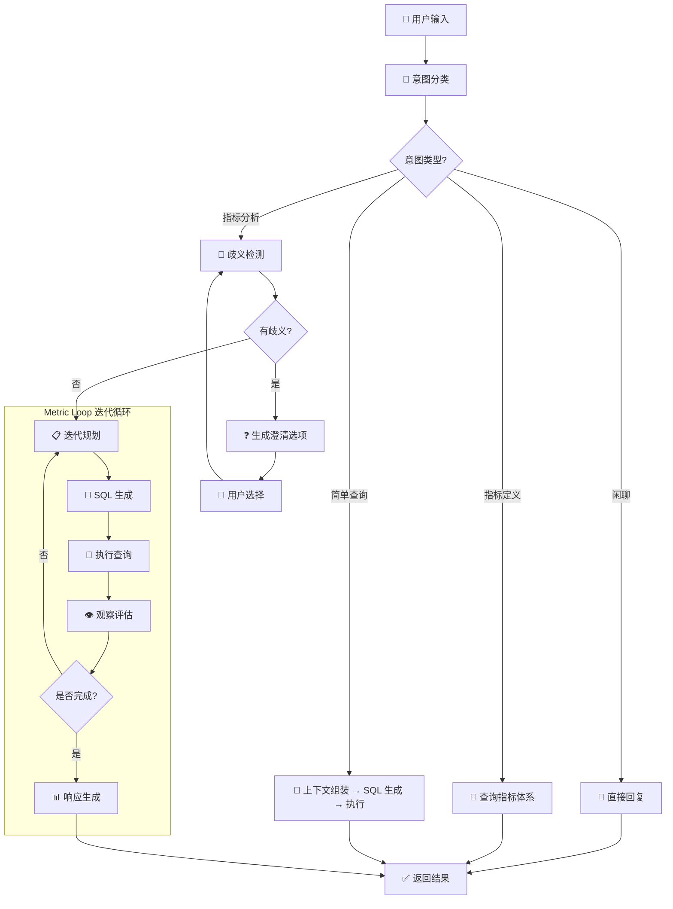

# Text2SQL 洞察中枢

基于 LangGraph 构建的教育指标体系 Text2SQL 智能体，支持意图识别、歧义澄清、多步迭代规划与 SQL 生成，提供 Web UI 和 CLI 双界面。

---

## 系统流程图


```mermaid
flowchart TD
    A[👤 用户输入] --> B[🧠 意图分类]
    B --> C{意图类型?}

    C -->|闲聊| D[💬 直接回复]
    C -->|指标定义| E[📖 查询指标体系]
    C -->|简单查询| F[📝 上下文组装 → SQL 生成 → 执行]
    C -->|指标分析| G[🔎 歧义检测]

    G --> H{有歧义?}
    H -->|是| I[❓ 生成澄清选项]
    I --> J[👤 用户选择]
    J --> G
    H -->|否| K[📋 迭代规划]

    subgraph Metric Loop 迭代循环
        K --> L[🤖 SQL 生成]
        L --> M[💾 执行查询]
        M --> N[👁 观察评估]
        N --> O{是否完成?}
        O -->|否| K
        O -->|是| P[📊 响应生成]
    end

    D --> Q[✅ 返回结果]
    E --> Q
    F --> Q
    P --> Q
```

---

## 双路径查询架构

系统根据意图类型路由到两条不同的处理路径：

| 路径 | 适用意图 | 流程 | 特点 |
|------|---------|------|------|
| **VALUE_QUERY** | 简单数据查询 | 分类 → 规划 → 上下文组装 → SQL生成 → 执行 → 响应 | 单次 SQL 执行 |
| **METRIC_QUERY** | 复杂指标分析 | 分类 → 歧义检测 → 迭代规划 → SQL生成 → 执行 → 观察 → （循环） → 响应 | 多步迭代，支持临时表 |

---

## Agent 清单

| Agent | 文件 | 职责 |
|-------|------|------|
| Intent Classifier | `intent_classifier.py` | 识别用户意图（闲聊/指标定义/简单查询/指标分析） |
| Ambiguity Checker | `ambiguity_checker.py` | 检测查询歧义，生成澄清选项 |
| Metric Loop Planner | `metric_loop_planner.py` | 拆解复杂指标任务为可执行步骤 |
| Context Assembler | `context_assembler.py` | 组装 SQL 生成所需的上下文信息 |
| SQL Generator | `sql_generator.py` | 生成可执行的 SQL 查询 |
| SQL Executor | `sql_executor.py` | 执行 SQL 并返回结果 |
| SQL Corrector | `sql_corrector.py` | SQL 执行失败时自动修正 |
| Metric SQL Generator | `metric_sql_generator.py` | 为指标分析步骤生成 SQL |
| Metric Executor | `metric_executor.py` | 执行指标分析步骤的 SQL |
| Metric Observer | `metric_observer.py` | 评估执行结果，决定继续/修正/完成 |
| Response Generator | `response_generator.py` | 将查询结果转换为自然语言回复 |
| Chart Generator | `chart_generator.py` | 基于 Vega-Lite 生成数据可视化图表 |
| Verifier | `verifier.py` | 验证执行结果的合理性 |

---

## 项目结构

```
text2sql/
├── api.py                  # FastAPI 服务（SSE 流式响应、会话管理）
├── main.py                 # CLI 交互入口
├── graph.py                # LangGraph 工作流定义与节点连接
├── state.py                # AgentState 类型定义
├── config.py               # 运行时配置（从 .env 加载）
├── runtime.py              # LLM / Embedding 客户端工厂
├── runtime_bootstrap.py    # 运行时初始化
├── requirements.txt        # Python 依赖
├── agents/                 # 各 Agent 节点实现（工厂模式）
├── prompts/                # Prompt 模板与领域配置
├── tools/                  # 数据库访问、日志、Schema 工具
├── ui/                     # 前端（Vue 3 + Element Plus）
│   ├── index.html
│   ├── style.css
│   └── script.js
├── 基教指标.json             # 教育指标体系定义
├── test_number.json         # 数据库 Schema 定义
└── tests/                   # 测试文件
```

---

## 前端功能

- **对话式交互**：自然语言查询，流式显示推理步骤与结果
- **执行计划面板**：可视化展示指标分析的多步执行计划、SQL、状态
- **数据查看**：表格弹窗展示查询结果，支持大数据量分页与回放
- **图表生成**：基于 Vega-Lite 自动生成数据可视化
- **建模视图**：展示指标体系层级结构（一级/二级指标，可折叠）
- **数据库视图**：展示当前数据库 Schema 定义
- **多会话管理**：支持对话历史、线程切换、草稿保存
- **深色/浅色主题**切换

---

## 快速开始

### 1. 安装依赖

```bash
cd text2sql
pip install -r requirements.txt
```

### 2. 配置环境变量

编辑 `.env` 文件：

```env
# LLM 配置
LLM_API_BASE=http://localhost:11434/v1
LLM_MODEL_NAME=qwen2.5:7b

# MySQL
DB_HOST=localhost
DB_PORT=3306
DB_USER=root
DB_PASSWORD=your_password
DB_NAME=education_metrics
```

### 3. 运行

```bash
# Web UI 模式
python api.py

# CLI 模式
python main.py
```

### 4. 访问

浏览器打开 `http://localhost:8000`

---

## API 端点

| 端点 | 方法 | 说明 |
|------|------|------|
| `/api/chat/stream` | POST | 流式对话（SSE） |
| `/api/chat` | POST | 非流式对话 |
| `/api/chart` | POST | 生成数据图表 |
| `/api/replay-data` | POST | 回放查询数据 |
| `/api/reset` | POST | 重置会话 |
| `/api/metrics` | GET | 获取指标体系数据 |
| `/api/schema` | GET | 获取数据库 Schema |
| `/api/health` | GET | 健康检查 |

---

## 技术栈

- **后端**：Python 3.10+ / LangGraph / LangChain / FastAPI / PyMySQL
- **前端**：Vue 3 / Element Plus / Marked.js / Vega-Lite
- **LLM**：兼容 OpenAI API 的本地/云端模型（默认 Ollama + Qwen2.5）
- **数据库**：MySQL 8.0
